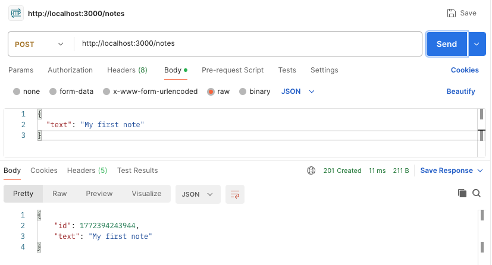
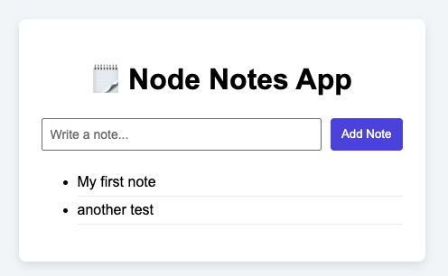

# 🗒️ Node Notes API Demo

A beginner-friendly Node.js backend project that demonstrates:

- What Node.js actually is
- How Node runs outside the browser
- Core modules (`http`, `fs`)
- ES Modules (`import/export`)
- Asynchronous file I/O
- Building a basic HTTP server
- Creating a simple JSON API

## What This Project Teaches

This demo connects directly to foundational Node concepts:

| Concept | Where You See It |
|----------|------------------|
| Node is a runtime | Running `node server.js` |
| Core modules | `http`, `fs/promises` |
| Modules | `import` / `export` |
| Async operations | `await fs.readFile()` |
| Server responsibilities | Handling HTTP routes |
| Providing APIs | `/notes` endpoint |
| Talking to storage | `notes.json` file |
| JSON responses | `res.end(JSON.stringify())` |
| Event-driven model | `req.on("data")` |

You are building a real backend — just without frameworks (yet).

## 📁 Project Structure

The project is now split into two separate applications:

- `backend/` → HTTP API server  
- `frontend/` → Static HTML, CSS, and JavaScript frontend  

```
node-notes-demo/
│
├── backend/
│   ├── package.json
│   ├── server.js
│   ├── notesService.js
│   ├── notes.json
│   └── node_modules/
│
└── frontend/
    ├── index.html
    ├── style.css
    └── script.js
```

The `backend/` folder contains the Express server.

Responsibilities:

- Handle HTTP requests  
- Expose API routes (`GET /notes`, `POST /notes`)  
- Perform file I/O using `notes.json`  
- Enable CORS for cross-origin requests  

The backend runs on:

```
http://localhost:3000
```

It does **not** serve HTML.  
It acts only as an API.

The `frontend/` folder contains static files:

- `index.html` → Page structure  
- `style.css` → Styling  
- `script.js` → Fetch requests + DOM updates  

### Why This Structure?

This structure introduces a modern API architecture:

- The frontend and backend are separate
- The backend focuses only on data and logic
- The frontend focuses only on UI and user interaction
- Communication happens over HTTP

This mirrors how real-world web applications are built.

## What Each File Does

### `server.js`
- Creates the HTTP server
- Handles routing
- Parses incoming request bodies
- Sends JSON responses

### `notesService.js`
- Handles file operations
- Reads and writes notes
- Keeps business logic separate from HTTP logic

### `notes.json`
- Acts as a simple file-based database

## How to Run the Project

### 1️⃣ Install dependencies

There are no external dependencies, but run:

```bash
npm install
```
### 2️⃣ Make Sure ES Modules Are Enabled

Open `package.json` and confirm this line exists:

```json
"type": "module"
```

If it’s missing, add it manually.

Why?

By default, Node uses the older **CommonJS** system (`require` / `module.exports`).  
Adding `"type": "module"` tells Node to use modern **ES Modules** (`import` / `export`) instead.

If you do not add this line, you will get an error like:

```
SyntaxError: Cannot use import statement outside a module
```

### 3️⃣ Start the server

```bash
npm start
```

You should see:

```
🚀 Server running at http://localhost:3000
```

## How to Test the API

There are multiple ways to test this server. Each method teaches something slightly different.

### 1️⃣ Testing in the Browser (GET Only)

Open this in your browser:

```
http://localhost:3000/notes
```

You’ll see raw JSON.

This demonstrates:

- The browser makes an HTTP request
- The Node server responds with data
- There is no HTML — just JSON

⚠️ Browsers cannot send POST requests without a form or JavaScript.

### 2️⃣ Testing with Postman 

Postman provides a visual interface for sending HTTP requests.

Steps:

1. Open Postman
2. Select `POST`
3. Enter:  
   `http://localhost:3000/notes`
4. Go to **Body**
5. Select **raw**
6. Choose **JSON**
7. Add:

```json
{
  "text": "My first note"
}
```

8. Click **Send**

You should receive a `201` response with your new note.

This helps you understand:
- HTTP methods (GET vs POST)
- Request headers
- Request body
- Response status codes



### 3️⃣ Testing with curl (Raw HTTP)

`curl` lets you send requests directly from the terminal.

### GET all notes:

```bash
curl http://localhost:3000/notes
```

### POST a new note:

```bash
curl -X POST http://localhost:3000/notes \
  -H "Content-Type: application/json" \
  -d '{"text":"Learn Node async"}'
```

This shows what GUI tools like Postman are doing behind the scenes.

### 4️⃣ Optional: Test With a Simple Frontend

Run the HTML file with LiveServer (http:127.0.0.1)



### ⚠️ Important: The Server Must Allow Cross-Origin Requests

If your backend runs on:

```
http://localhost:3000
```

And your frontend runs on:

```
http://127.0.0.1:5500
```

Those are considered **different origins**.

An origin is:

```
protocol + domain + port
```

So even small differences matter:

- `localhost` ≠ `127.0.0.1`
- Port `3000` ≠ `5500`

When the origin changes, the browser treats it as a **cross-origin request**.

By default, the browser will block that request unless the **server explicitly allows it**.

### CORS

**Cross-Origin Resource Sharing**

It is a browser security feature that prevents one origin from accessing resources from another origin unless the server sends permission headers.

Important:

> Node does not block requests.  
> The browser blocks them unless the server allows them.

### How Our Node Notes Server Allows It

In our `server.js`, we enable CORS by setting special headers:

```js
const FRONTEND_ORIGIN = "http://127.0.0.1:5500";

res.setHeader("Access-Control-Allow-Origin", FRONTEND_ORIGIN);
res.setHeader("Access-Control-Allow-Methods", "GET, POST, OPTIONS");
res.setHeader("Access-Control-Allow-Headers", "Content-Type");
```

These headers tell the browser:

- Which origin is allowed
- Which HTTP methods are allowed
- Which headers are allowed

We also handle the preflight request:

```js
if (req.method === "OPTIONS") {
  res.writeHead(204);
  return res.end();
}
```

>When we previously used `json-server`, we did not configure CORS manually. Because json-server automatically enables CORS for development.

## API Routes

### GET `/notes`

Returns all notes.

Example response:

```json
[
  {
    "id": 1700000000000,
    "text": "Learn Node"
  }
]
```

### POST `/notes`

Creates a new note.

Body:

```json
{
  "text": "New note text"
}
```

Returns:

```json
{
  "id": 1700000000000,
  "text": "New note text"
}
```
## What Is Happening Behind the Scenes?

When you visit:

```
http://localhost:3000/notes
```

Here’s what happens:

1. The browser sends an HTTP request.
2. Node's `http` server receives it.
3. The server checks the method and URL.
4. The server reads `notes.json` asynchronously.
5. The server sends JSON back as a response.

This demonstrates:

- Node runs outside the browser.
- Node handles network requests.
- Node performs asynchronous file I/O.
- Node sends structured JSON responses.

### 🌐 Now Add a Frontend (Full Stack)

When you build a simple frontend (HTML + JavaScript) and run it using Live Server, it might run on:

```
http://127.0.0.1:5500
```

Your backend runs on:

```
http://localhost:3000
```

Now the flow becomes:

Frontend (5500) → HTTP request → Node backend (3000) → File storage → JSON response → DOM update

The frontend uses:

```js
fetch("http://localhost:3000/notes")
```

to retrieve data and update the DOM.

This completes the full-stack connection.

## 🎯 Key Takeaway

Node.js moves JavaScript beyond the browser.

Instead of manipulating the DOM, your code can now:

- Handle HTTP requests
- Manage files
- Store data
- Power APIs
- Run backend logic

When combined with a frontend:

Browser DOM logic → HTTP request → Server logic → File/database → JSON → DOM update

This demo shows the complete bridge between client-side and server-side JavaScript.